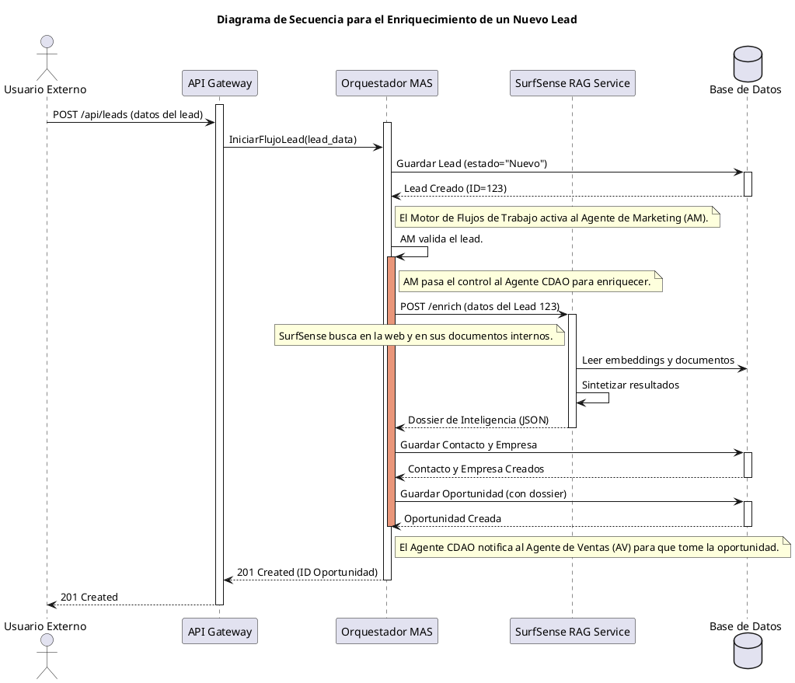
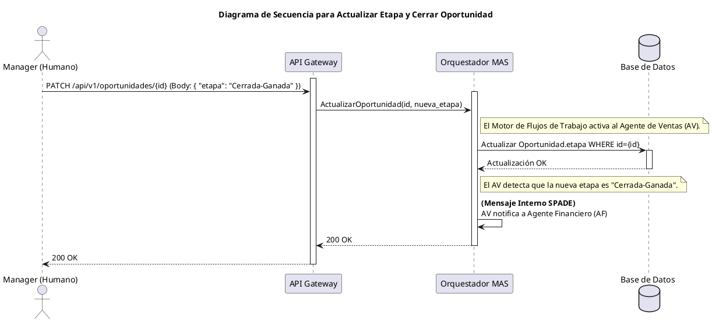
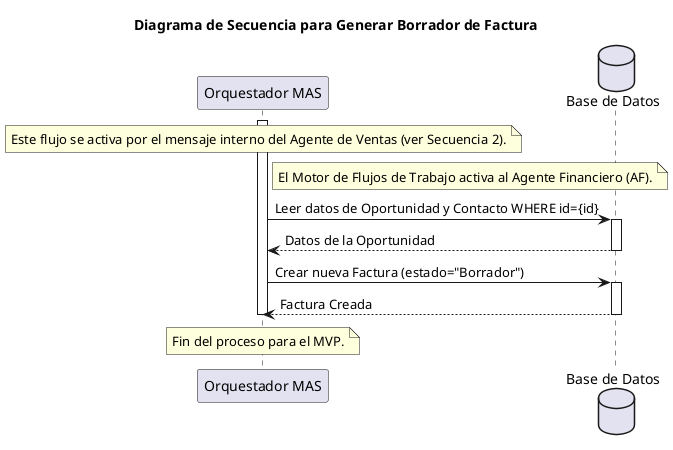
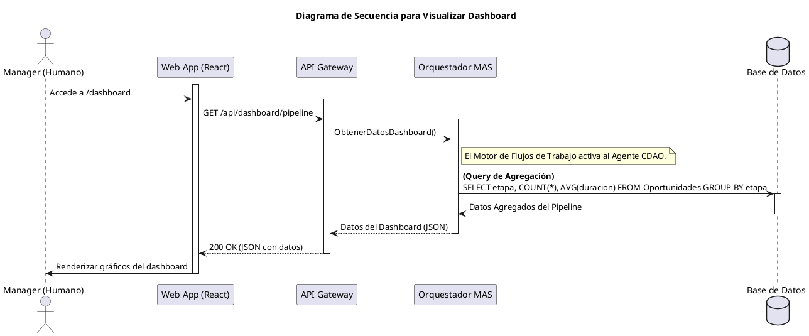

### **Fase 0: Definición y Alcance del Producto (Versión Final Consolidada)**

**Actividad:** Formalizar la estrategia de negocio y el alcance del MVP en el Lean Canvas.

**Lean Canvas: Organis.AI (Versión 2.0)**

| **1. Problema** | **2. Segmentos de Clientes** | **3. Propuesta Única de Valor (UVP)** | **4. Solución** |
| :--- | :--- | :--- | :--- |
| 1. **Silos de Información y Procesos Rotos:** Coordinación interdepartamental manual, lenta y propensa a errores. | **Early Adopters:** PYMES tecnológicas y consultorías (100-500 empleados) que buscan eficiencia a través de la automatización inteligente. | **El Gemelo Digital Organizativo que potencia a tus equipos con agentes de IA modulares. Cada agente viene pre-entrenado con un cerebro de investigación (SurfSense) que enriquece cada tarea con contexto interno y externo.** | 1. **Plataforma de Agentes de IA Modulares:** Los clientes activan agentes que replican funciones departamentales (Ventas, Finanzas, Marketing). |
| 2. **Toma de Decisiones Reactiva:** Directivos basan decisiones en datos históricos e incompletos. | **Clientes Secundarios:** Departamentos específicos dentro de grandes corporaciones que buscan optimizar sus operaciones. | (Enfoque en el "dolor": No solo automatices tareas, hazlas más inteligentes.) | 2. **Agente CDAO proactivo con SurfSense:** Agente central que unifica datos, enriquece leads con inteligencia de mercado en tiempo real y recomienda acciones. |
| 3. **Falta de Contexto en Tareas Clave:** Los equipos de ventas y marketing operan con información limitada sobre los leads, reduciendo la eficacia. | | | 3. **Automatización de Flujos Transversales:** Herramientas para mapear y ejecutar procesos que involucran a múltiples agentes (ej. "Lead a Ingreso Inteligente"). |
| **Alternativas Existentes:** Herramientas pasivas (ERPs, CRMs), plataformas de automatización sin inteligencia contextual profunda (Zapier, Make). | | | 4. **Dashboard de Supervisión Unificado:** Interfaz humana para monitorizar agentes, gestionar excepciones y visualizar los insights del CDAO. |

| **5. Canales** | **6. Flujos de Ingresos** | **7. Estructura de Costes** | **8. Métricas Clave** | **9. Ventaja Injusta** |
| :--- | :--- | :--- | :--- | :--- |
| 1. Venta Directa Consultiva (B2B). | 1. **Suscripción a la Plataforma Base:** Incluye el Agente CDAO + SurfSense Engine y la infraestructura. | 1. I+D y Talento (Coste Principal). | 1. **Métricas de Éxito del Cliente:** (a) **% de Leads Enriquecidos Automáticamente**. (b) Reducción del tiempo del ciclo "Lead a Cierre". (c) Aumento de la tasa de conversión. | 1. **Blueprint Organizacional Propietario:** Nuestro modelo de conocimiento de roles y procesos acelera el desarrollo de las capacidades de los agentes. |
| 2. Marketing de Contenidos. | 2. **Suscripción por Módulo de Agentes:** Precio adicional por "departamento" activado. | 2. Infraestructura Cloud y APIs (Coste variable principal). | 2. **Métricas de Negocio:** (a) Ingreso Mensual Recurrente (MRR). (b) Tasa de Adopción de Módulos. (c) Tasa de Abandono (Churn). | 2. **Motor RAG Pre-integrado (SurfSense):** Nos da una capacidad de IA avanzada desde el día uno, una barrera técnica enorme para competidores que empiecen de cero. |
| 3. Partnerships con consultoras. | 3. Servicios Profesionales (Implementación). | 3. Ventas y Marketing. | | 3. **Efecto Red de Datos:** Los modelos de los agentes mejoran con el uso (anónimo y agregado), creando un foso competitivo. |

**Definición del Producto Mínimo Viable (MVP) (Versión Final):**

El objetivo del MVP es validar la hipótesis: *¿Puede nuestro sistema, usando un Agente CDAO potenciado por SurfSense, enriquecer automáticamente un lead y entregar un dossier de inteligencia que acelere y mejore el proceso de venta de forma medible?*

*   **Proceso Central:** Flujo **"Lead a Ingreso Inteligente"**.
*   **Agentes Modulares (MVP "Sales Starter Pack"):**
    *   **Agente de Marketing (Lite):** Captura y valida leads.
    *   **Agente CDAO (MVP Core):** Usa su instancia de **SurfSense** para enriquecer el lead (búsqueda web, análisis de dominio) y recomendar productos.
    *   **Agente de Ventas (Lite):** Recibe el dossier de inteligencia y crea una oportunidad pre-poblada y contextualizada.
    *   **Agente Financiero (Lite):** Detecta "Cierre-Ganado" y genera borrador de factura.
*   **Plataforma:**
    *   Arquitectura de microservicios.
    *   **Despliegue de una instancia de SurfSense por cliente** para garantizar el aislamiento de datos.

---

### **Fase 1: Análisis de Actores y Casos de Uso (Versión Final Consolidada)**

**Actividad:** Formalizar el flujo funcional detallado del MVP, reflejando el rol activo del CDAO y SurfSense.

**1. Actores:**

*   **Humanos:** Manager, Empleado.
*   **IA:** Agente de Marketing (AM), Agente CDAO (ACDAO), Agente de Ventas (AV), Agente Financiero (AF).
*   **Externos:** Sistema de Leads, **Motor de Conocimiento (SurfSense Service)**.

**2. Diagrama de Casos de Uso:**
(El diagrama visual conceptualmente sigue siendo el de la "Versión 2" que definimos en el paso anterior, con el CDAO en el centro del flujo temprano).

**3. Descripción Detallada de Casos de Uso (Flujo Consolidado):**

**Caso de Uso 1: Ingestar y Validar Lead**
*   **Actor:** Agente de Marketing (AM).
*   **Flujo:**
    1. Recibe datos del lead.
    2. Realiza validación técnica.
    3. Almacena el lead con estado "Nuevo, Pendiente de Enriquecimiento".
    4. **Envía una solicitud de "Enriquecimiento de Lead" al Agente CDAO.**

**Caso de Uso 2: Enriquecer y Pre-calificar Lead con Motor de Conocimiento**
*   **Actores:** Agente CDAO (ACDAO), Motor de Conocimiento (SurfSense Service).
*   **Flujo:**
    1. El ACDAO recibe la solicitud del AM.
    2. El ACDAO **instruye a su Motor de Conocimiento (SurfSense)** para que realice las siguientes acciones a través de su API:
        *   **Query Externa:** Buscar en la web (usando conectores de SearxNG/Tavily) información sobre la empresa del lead.
        *   **Query Interna:** Buscar en la base de conocimiento interna (documentos de producto previamente cargados en SurfSense) los servicios que mejor encajen con el perfil del lead.
    3. SurfSense ejecuta las búsquedas, sintetiza los resultados y los devuelve al ACDAO.
    4. El ACDAO compila la respuesta en un "Dossier de Inteligencia".
    5. El ACDAO **notifica al Agente de Ventas (AV), entregándole el dossier**.
    6. Actualiza el estado del lead a "Cualificado con Inteligencia".

**Caso de Uso 3: Crear Oportunidad Inteligente**
*   **Actor:** Agente de Ventas (AV).
*   **Flujo:**
    1. Recibe el dossier del ACDAO.
    2. Crea una "Oportunidad" pre-poblada con los datos enriquecidos y las recomendaciones de producto.
    3. Informa al ACDAO del evento "Oportunidad Creada".

**Caso de Uso 4: Actualizar Etapa de Oportunidad**
*   **Actor:** Agente de Ventas (AV).
*   **Flujo:**
    1. Actualiza la etapa de la oportunidad (ej. "Propuesta Presentada", "Cerrada-Ganada").
    2. Si es "Cerrada-Ganada", **notifica al Agente Financiero (AF)**.
    3. Informa al ACDAO de cada cambio de etapa para el análisis de KPIs.

**Caso de Uso 5: Generar Borrador de Factura**
*   **Actor:** Agente Financiero (AF).
*   **Flujo:**
    1. Recibe la notificación del AV.
    2. Genera un borrador de factura con estado "Pendiente de Revisión Humana".
    3. Informa al ACDAO del evento "Borrador de Factura Creado".

**Caso de Uso 6: Visualizar Dashboard Inteligente**
*   **Actor:** Manager (Humano).
*   **Flujo:** Accede a la interfaz para ver los KPIs generados por el ACDAO, que ahora incluyen métricas sobre la calidad y el perfil de los leads enriquecidos.

**Caso de Uso 7: Gestionar Excepción**
*   **Actores:** Cualquier Agente, Empleado, Manager.
*   **Flujo:** Proceso de escalada a un humano cuando un agente no puede completar una tarea.


### **Fase 2: Diseño de la Arquitectura de Alto Nivel (Modelo C4)**

**Actividad:** El objetivo es crear una vista clara y comprensible de la estructura de nuestro software. Usaremos el **Modelo C4** porque es excelente para describir sistemas en diferentes niveles de detalle, facilitando la comunicación entre roles técnicos y no técnicos.

Para alinear con tus preferencias por las prácticas modernas, generaremos estos diagramas usando **PlantUML**. Esto nos da "Diagramas como Código": son versionables, mantenibles y fáciles de actualizar.

---

### **1. Nivel 1 del C4: Diagrama de Contexto del Sistema**

Este es el nivel más alto, la vista de "zoom out". Muestra cómo nuestro sistema, **Organis.AI**, encaja en el mundo, quiénes lo usan y con qué otros sistemas interactúa. No vemos tecnología ni detalles internos, solo el panorama general.

**Explicación del Diagrama:**

*   **Sistema Central:** Nuestro `Organis.AI`.
*   **Actores Humanos:** El `Manager` y el `Empleado` que lo utilizan para supervisar y gestionar el trabajo de los agentes.
*   **Sistemas Externos:**
    *   `Sistema Externo de Leads`: La fuente de entrada de nuevos clientes potenciales (ej. un formulario web, un CRM).
    *   `Fuentes Públicas de Datos`: El vasto universo de información en Internet (webs de empresas, LinkedIn, etc.) que nuestro sistema consultará para el enriquecimiento.

**Diagrama como Código (PlantUML):**

```plantuml
@startuml
!include https://raw.githubusercontent.com/plantuml-stdlib/C4-PlantUML/master/C4_Context.puml

LAYOUT_WITH_LEGEND()

title Diagrama de Contexto del Sistema para Organis.AI

Person(manager, "Manager / Empleado", "Supervisa el pipeline y gestiona excepciones.")
System_Ext(lead_system, "Sistema Externo de Leads", "Formularios web, CRM, etc.")
System_Ext(public_data, "Fuentes Públicas de Datos", "Sitios web, redes profesionales, etc.")

System(organis_ai, "Organis.AI", "Plataforma de agentes de IA que automatiza y potencia flujos de negocio.")

Rel(manager, organis_ai, "Usa para supervisar y gestionar")
Rel(lead_system, organis_ai, "Envía nuevos leads")
Rel(organis_ai, public_data, "Busca información para enriquecer leads")
@enduml
```
---

### **2. Nivel 2 del C4: Diagrama de Contenedores**

Ahora hacemos "zoom in" dentro de la caja `Organis.AI`. Un "contenedor" en el modelo C4 no es necesariamente un contenedor Docker, sino un **bloque de software desplegable e independiente**. Este diagrama es el plano arquitectónico principal para el equipo de desarrollo.

**Explicación del Diagrama:**

Aquí se materializan nuestras decisiones técnicas. Descomponemos `Organis.AI` en sus principales piezas de software:

*   **Web App (React):** La interfaz de usuario single-page que corre en el navegador del cliente. Es cómo los humanos interactúan con el sistema.
*   **API Gateway (FastAPI):** La puerta de entrada única y segura para todas las peticiones. Gestiona la autenticación y enruta las solicitudes al servicio correcto.
*   **Orquestador MAS (SPADE):** El corazón de nuestra lógica de negocio. Es donde viven y se coordinan nuestros agentes (AM, AV, AF, ACDAO). Gestiona los flujos de trabajo y la comunicación inter-agente.
*   **SurfSense RAG Service (FastAPI, LangGraph):** Nuestro motor de inteligencia especializado. Lo tratamos como un servicio interno independiente cuya única misión es responder a las peticiones de enriquecimiento del Orquestador MAS.
*   **Base de Datos (PostgreSQL + pgvector):** Nuestro único almacén de datos para el MVP. Guarda tanto los datos de negocio (leads, oportunidades, facturas) como los datos vectoriales (embeddings) que SurfSense necesita para sus búsquedas semánticas.

**Diagrama como Código (PlantUML):**

```plantuml
@startuml
!include https://raw.githubusercontent.com/plantuml-stdlib/C4-PlantUML/master/C4_Container.puml

LAYOUT_WITH_LEGEND()

title Diagrama de Contenedores para Organis.AI

Person(manager, "Manager / Empleado", "Supervisa el pipeline y gestiona excepciones.")
System_Ext(lead_system, "Sistema Externo de Leads", "Formularios web, CRM, etc.")
System_Ext(public_data, "Fuentes Públicas de Datos", "Sitios web, redes profesionales, etc.")

System_Boundary(organis_ai, "Organis.AI") {
    Container(webapp, "Web App", "React", "Proporciona la interfaz de usuario para la supervisión y gestión.")
    Container(api_gateway, "API Gateway", "Python, FastAPI", "Expone la API REST, gestiona la autenticación y el enrutamiento.")
    
    Container(mas_orchestrator, "Orquestador MAS", "Python, SPADE", "Ejecuta y coordina los agentes de IA (Marketing, Ventas, Finanzas, CDAO). Gestiona los flujos de trabajo.")
    
    Container(rag_service, "SurfSense RAG Service", "Python, FastAPI, LangGraph", "Provee 'RAG as a Service'. Enriquece los datos buscando en fuentes internas y externas.")
    
    ContainerDb(db, "Base de Datos", "PostgreSQL, pgvector", "Almacena datos de negocio (leads, oportunidades) y los embeddings vectoriales para la búsqueda semántica.")
}

' Relaciones de Usuario
Rel(manager, webapp, "Usa", "HTTPS")
Rel(webapp, api_gateway, "Realiza llamadas a la API", "HTTPS/JSON")
Rel(lead_system, api_gateway, "Envía nuevos leads via Webhook", "HTTPS")

' Flujo Interno
Rel(api_gateway, mas_orchestrator, "Delega tareas a los agentes", "HTTPS/JSON (Llamada asíncrona)")

Rel(mas_orchestrator, db, "Lee y escribe datos de negocio", "TCP")
Rel(mas_orchestrator, rag_service, "Solicita enriquecimiento de datos", "HTTPS/API Call")

Rel(rag_service, db, "Lee y escribe embeddings y caché de documentos", "TCP")
Rel(rag_service, public_data, "Realiza búsquedas externas", "HTTPS")

@enduml
```


---

### **3. Nivel de Despliegue (Extra): Diagrama de Despliegue del MVP**

Este diagrama complementa la vista de contenedores mostrando cómo estos se desplegarán en la infraestructura en un entorno de desarrollo local usando Docker. Proporciona un plano claro para la creación del archivo `docker-compose.yml`.

**Explicación del Diagrama:**

*   **Nodo Principal:** `Máquina del Desarrollador`, que ejecuta Docker.
*   **Contenedores de Aplicación:** Cada uno de nuestros servicios (`Web App`, `API Gateway`, `Orquestador MAS`, `SurfSense`) se ejecuta en su propio contenedor Docker.
*   **Nodo de Base de Datos:** Se utiliza un contenedor específico para la base de datos PostgreSQL, asegurando el aislamiento y la portabilidad de los datos.

**Diagrama como Código (PlantUML):**

```plantuml
@startuml
!include https://raw.githubusercontent.com/plantuml-stdlib/C4-Plant-UML/master/C4_Deployment.puml

LAYOUT_WITH_LEGEND()

title Diagrama de Despliegue (Entorno Docker Local)

Deployment_Node("Máquina del Desarrollador", "Docker Engine", "Representa la infraestructura virtual local") {
    
    Container(webapp, "Web App", "React/Nginx", "Contenedor Nginx sirviendo los archivos estáticos de React.")
    Container(gateway, "API Gateway", "FastAPI/Uvicorn", "Contenedor Python ejecutando el servicio de API.")
    Container(orchestrator, "Orquestador MAS", "SPADE/Python", "Contenedor Python ejecutando los agentes.")
    Container(rag, "SurfSense RAG Service", "FastAPI/Uvicorn", "Contenedor Python ejecutando el servicio de enriquecimiento.")
    
    Deployment_Node("Contenedor de BD", "Docker Container", "PostgreSQL") {
        ContainerDb(db, "Base de Datos", "PostgreSQL + pgvector", "Almacena todos los datos de la aplicación.")
    }
}

' Relaciones entre contenedores
Rel(webapp, gateway, "Llama a API", "HTTPS")
Rel(gateway, orchestrator, "Delega Tareas", "HTTPS")
Rel(orchestrator, rag, "Solicita Enriquecimiento", "HTTPS")
Rel(orchestrator, db, "Lee/Escribe", "TCP")
Rel(rag, db, "Lee/Escribe", "TCP")
@enduml


### **Fase 3: Modelado de Datos Conceptual (Versión Final Corregida y Aprobada)**

**Actividad:** Definir las principales entidades de información de nuestro sistema y sus interrelaciones para el MVP. Este Diagrama Entidad-Relación (ERD) conceptual servirá como el mapa de datos fundamental para todo el equipo de desarrollo.

**Principio Rector:** El modelo soporta una relación de 1-a-muchos entre un `Contacto` y sus `Oportunidades` para garantizar la escalabilidad futura. Sin embargo, el flujo de trabajo del MVP se centrará exclusivamente en el proceso de "conversión", donde un `Lead` da origen a un `Contacto` y a su *primera* `Oportunidad`.

---

### **1. Entidades Clave del MVP**

*   **Lead:** El punto de entrada efímero para información no cualificada.
*   **Contacto:** La entidad persistente que representa a una persona en una empresa. Es el ancla para todas las interacciones a largo plazo.
*   **Empresa:** La organización a la que pertenece un `Contacto`.
*   **Oportunidad:** Una negociación o proceso de venta específico, siempre asociado a un `Contacto`.
*   **Factura:** El resultado financiero de una oportunidad ganada.
*   **Usuario (Humano):** Los empleados que usan y supervisan el sistema.
*   **Agente (IA):** Los agentes virtuales definidos en la plataforma.
*   **Tarea de Agente:** El registro de auditoría detallado de las acciones de los agentes.

### **2. Diagrama Entidad-Relación (ERD) Conceptual**

A continuación se presenta el diagrama final, con la sintaxis de Mermaid corregida para representar adecuadamente tanto las relaciones de clave foránea (líneas continuas) como las relaciones de proceso o conversión (líneas punteadas).

**Visualización como Código (Mermaid):**

```mermaid
erDiagram
    Empresa {
        UUID id PK
        string nombre
        string sitio_web
        string sector "Datos enriquecidos por CDAO"
    }

    Contacto {
        UUID id PK
        UUID empresa_id FK
        string nombre
        string email
        string puesto "Datos enriquecidos por CDAO"
    }

    Lead {
        UUID id PK
        string origen "Ej: 'Formulario Web', 'Evento'"
        string estado "'Nuevo', 'Convertido', 'Descartado'"
        string nombre_crudo
        string email_crudo
        string empresa_crudo
    }

    Oportunidad {
        UUID id PK
        UUID contacto_id FK
        string etapa "'Contacto Inicial', 'Propuesta', 'Cerrada-Ganada'"
        decimal valor_estimado
        json dossier_inteligencia "Almacena los hallazgos de SurfSense"
    }

    Factura {
        UUID id PK
        UUID oportunidad_id FK
        string estado "'Borrador', 'Enviada'"
        decimal monto
    }

    Usuario {
        UUID id PK
        string nombre
        string email
        string rol "'Manager', 'Empleado'"
    }

    Agente {
        UUID id PK
        string nombre "'Agente de Marketing', 'Agente CDAO', etc."
        string tipo
    }

    TareaDeAgente {
        UUID id PK
        UUID agente_id FK
        string tipo_tarea "'Enriquecer Lead', 'Crear Oportunidad'"
        string estado "'Completada', 'Fallida'"
        json input_data
        json output_data
        datetime timestamp
    }

    Empresa ||--|{ Contacto : "tiene"
    Contacto ||--|{ Oportunidad : "tiene"
    Lead ||..|| Contacto : "se convierte en"
    Lead ||..|| Oportunidad : "crea la primera"
    Oportunidad }|--|| Factura : "genera"
    Usuario ||--|{ Oportunidad : "es asignado a"
    Agente ||--|{ TareaDeAgente : "ejecuta"
```

### **3. Descripción del Flujo de Datos en el Proceso de "Conversión"**

Este modelo de datos define un flujo de trabajo claro que ahora podemos describir:

1.  **Creación del `Lead`:** Se crea un nuevo registro en la tabla `Lead` con la información cruda (`nombre_crudo`, `email_crudo`, etc.). Su estado es "Nuevo".
2.  **Proceso de Cualificación:** Los agentes AM y CDAO procesan el `Lead`.
3.  **Conversión Exitosa:**
    *   El sistema busca si ya existe un `Contacto` con ese `email`. Si no existe, crea un nuevo `Contacto` y una nueva `Empresa` (si es necesario), poblando los campos con los datos enriquecidos por el CDAO. Si ya existe, simplemente lo asocia.
    *   Se crea una nueva `Oportunidad` vinculada al `Contacto` correspondiente.
    *   El estado del `Lead` original se actualiza a "Convertido". El `Lead` ya ha cumplido su propósito y se vuelve inactivo.
4.  **Gestión a Largo Plazo:** Todas las futuras interacciones y ventas cruzadas (post-MVP) crearán nuevas `Oportunidades` directamente asociadas al `Contacto`, sin necesidad de pasar por el proceso de `Lead`.

### **Fase 4: Profundización de la Arquitectura y Flujos Clave**

**Actividad:** El objetivo de esta fase es descomponer uno de nuestros "contenedores" (C2) en sus "componentes" lógicos internos (C3) y trazar un flujo de comunicación detallado a través de ellos con un Diagrama de Secuencia. Esto nos dará un plano detallado para que los desarrolladores puedan empezar a construir la lógica interna del servicio.

---

### **1. Nivel 3 del C4: Diagrama de Componentes del `Orquestador MAS`**

Hemos elegido el contenedor **`Orquestador MAS (SPADE)`** porque es el cerebro de nuestro sistema, donde reside toda la lógica de los agentes y los flujos de trabajo. Vamos a ver de qué piezas está hecho por dentro.

**Explicación de los Componentes:**

*   **Motor de Flujos de Trabajo:** Es el componente de más alto nivel. Contiene la lógica de negocio del proceso "Lead a Ingreso". Sabe qué agente debe actuar y cuándo, orquestando la secuencia completa.
*   **Gestor de Agentes:** Responsable del ciclo de vida de nuestros agentes de IA. Los crea, los registra en la plataforma SPADE y monitoriza su estado (ej. ocupado, disponible, en error).
*   **Núcleo de Comunicación (SPADE Engine):** La implementación de bajo nivel del protocolo XMPP. Es la "centralita telefónica" que permite a los agentes enviarse mensajes entre sí de forma fiable. El `Gestor de Agentes` y el `Motor de Flujos de Trabajo` lo utilizan para comunicarse.
*   **Interfaz del Servicio RAG (Cliente SurfSense):** Un componente especializado (un "Adaptador") cuya única responsabilidad es comunicarse con la API de nuestro `SurfSense RAG Service`. Abstrae la complejidad de la llamada de red.
*   **Repositorio de Datos:** Gestiona toda la comunicación con la `Base de Datos`. Proporciona métodos como `crearLead()`, `obtenerOportunidadPorId()`, etc., para que el resto de los componentes no tengan que hablar SQL directamente.

**Diagrama como Código (PlantUML):**

```plantuml
@startuml
!include https://raw.githubusercontent.com/plantuml-stdlib/C4-PlantUML/master/C4_Component.puml

LAYOUT_WITH_LEGEND()

title Diagrama de Componentes para el Contenedor "Orquestador MAS"

ContainerDb(db, "Base de Datos", "PostgreSQL, pgvector", "Almacena datos de negocio y vectores.")
Container(rag_service, "SurfSense RAG Service", "FastAPI, LangGraph", "Provee 'RAG as a Service'.")
Container(api_gateway, "API Gateway", "FastAPI", "Recibe las peticiones externas.")

Container_Boundary(mas_orchestrator, "Orquestador MAS") {
    Component(workflow_engine, "Motor de Flujos de Trabajo", "Python", "Orquesta el flujo 'Lead a Ingreso'. Contiene la lógica de negocio principal.")
    Component(agent_manager, "Gestor de Agentes", "Python", "Gestiona el ciclo de vida de los agentes de IA (AM, CDAO, AV, AF).")
    Component(spade_engine, "Núcleo de Comunicación", "SPADE (XMPP)", "Gestiona la mensajería de bajo nivel entre agentes.")
    Component(rag_client, "Interfaz del Servicio RAG", "Python", "Cliente HTTP para comunicarse con la API de SurfSense.")
    Component(data_repo, "Repositorio de Datos", "Python (SQLAlchemy)", "Proporciona acceso a la base de datos para las entidades de negocio.")
}

' Relaciones Externas
Rel(api_gateway, workflow_engine, "Inicia un nuevo flujo de trabajo", "HTTPS/JSON")
Rel(data_repo, db, "Lee y escribe datos", "SQL/TCP")
Rel(rag_client, rag_service, "Solicita enriquecimiento de datos", "HTTPS/JSON")

' Relaciones Internas
Rel(workflow_engine, agent_manager, "Indica qué agente debe actuar")
Rel(workflow_engine, data_repo, "Persiste el estado del flujo")
Rel(workflow_engine, rag_client, "Utiliza para obtener datos enriquecidos")

Rel(agent_manager, spade_engine, "Utiliza para registrar agentes y enviar mensajes")

@enduml
```

---

### **2. Diagrama de Secuencia: Flujo "Enriquecimiento de un Nuevo Lead"**

Ahora que tenemos las piezas internas, vamos a verlas en acción. Este diagrama muestra la secuencia exacta de llamadas y mensajes para nuestro caso de uso más crítico e innovador.

**Explicación del Flujo:**

El diagrama traza el viaje de un nuevo lead desde que llega a nuestro sistema hasta que se crea una `Oportunidad Inteligente`. Muestra cómo los componentes del `Orquestador MAS` colaboran entre sí y con otros servicios.

**Diagrama como Código (PlantUML):**




### **Diagrama de Secuencia 2: Flujo "Actualizar Etapa y Cerrar Oportunidad"**

**Propósito para Copilot:** Este diagrama muestra cómo el `Agente de Ventas` gestiona el estado de una oportunidad y cómo se desencadena la comunicación inter-agente hacia el `Agente Financiero` al cerrar un trato.

**Diagrama como Código (PlantUML):**



---

### **Diagrama de Secuencia 3: Flujo "Generar Borrador de Factura"**

**Propósito para Copilot:** Este diagrama ilustra un flujo puramente interno y asíncrono. Muestra cómo el `Agente Financiero` actúa en respuesta a un evento interno, sin una solicitud directa del usuario.

**Diagrama como Código (PlantUML):**


---

### **Diagrama de Secuencia 4: Flujo "Visualizar Dashboard"**

**Propósito para Copilot:** Este diagrama detalla un flujo de solo lectura (`read-only`), mostrando cómo el `Agente CDAO` es responsable de agregar y presentar los datos para la interfaz humana.

**Diagrama como Código (PlantUML):**


### **Fase 5: Guía de Implementación del MVP**

Esta fase consolida todas las especificaciones técnicas, requisitos no funcionales y directrices de desarrollo necesarias para construir el MVP. Sirve como la guía definitiva para la implementación.

#### **1. Stack Tecnológico**

*   **Frontend:** React (Vite + TypeScript), Tailwind CSS para estilos.
*   **API Gateway:** Python 3.11+, FastAPI.
*   **Orquestador MAS:** Python 3.11+, biblioteca SPADE (para agentes XMPP).
*   **Servicio RAG:** SurfSense (desplegado como servicio independiente, accesible vía API REST).
*   **Base de Datos:** PostgreSQL 15+ con extensión `pgvector`.
*   **Comunicación Interna (Gateway -> Orquestador):** HTTP asíncrono (para simplicidad del MVP).
*   **Despliegue:** Docker Compose para desarrollo local.

#### **2. Estructura del Proyecto (Monorepo)**

Para facilitar el trabajo con Copilot, una estructura de monorepo permite que la IA tenga contexto de todas las partes del sistema fácilmente.

```text
organis-ai/
├── docker-compose.yml          # Orquestación local de todos los servicios
├── README.md                   # Documentación general
│
├── backend-gateway/            # Servicio API Gateway (FastAPI)
│   ├── app/
│   │   ├── routers/            # Endpoints definidos abajo
│   │   ├── schemas/            # Modelos Pydantic (request/response)
│   │   └── main.py
│   ├── Dockerfile
│   └── requirements.txt
│
├── backend-orchestrator/       # Servicio Orquestador MAS (SPADE)
│   ├── app/
│   │   ├── agents/             # Lógica de cada agente
│   │   ├── models/             # Modelos SQLAlchemy
│   │   └── main.py
│   ├── Dockerfile
│   └── requirements.txt
│
├── external-services/
│   └── surfsense/              # Configuración para desplegar SurfSense
│
└── frontend/                   # Aplicación Web React
    ├── src/
    └── package.json
```

#### **3. Esquema de Base de Datos Físico (PostgreSQL)**

Este esquema traduce nuestro ERD conceptual a definiciones SQL concretas que Copilot puede usar para generar modelos de ORM (SQLAlchemy/SQLModel).

```sql
-- Habilitar extensión para UUIDs
CREATE EXTENSION IF NOT EXISTS "uuid-ossp";

CREATE TABLE empresas (
    id UUID PRIMARY KEY DEFAULT uuid_generate_v4(),
    nombre VARCHAR(255) NOT NULL,
    sitio_web VARCHAR(255),
    sector VARCHAR(100), -- Enriquecido por CDAO
    created_at TIMESTAMP WITH TIME ZONE DEFAULT NOW(),
    updated_at TIMESTAMP WITH TIME ZONE DEFAULT NOW()
);

CREATE TABLE contactos (
    id UUID PRIMARY KEY DEFAULT uuid_generate_v4(),
    empresa_id UUID REFERENCES empresas(id),
    nombre VARCHAR(255) NOT NULL,
    email VARCHAR(255) UNIQUE NOT NULL,
    puesto VARCHAR(100), -- Enriquecido por CDAO
    created_at TIMESTAMP WITH TIME ZONE DEFAULT NOW(),
    updated_at TIMESTAMP WITH TIME ZONE DEFAULT NOW()
);

CREATE TABLE leads (
    id UUID PRIMARY KEY DEFAULT uuid_generate_v4(),
    estado VARCHAR(50) NOT NULL DEFAULT 'NUEVO', -- 'NUEVO', 'ENRIQUECIDO', 'CONVERTIDO', 'DESCARTADO'
    origen VARCHAR(100),
    nombre_crudo VARCHAR(255),
    email_crudo VARCHAR(255),
    empresa_crudo VARCHAR(255),
    created_at TIMESTAMP WITH TIME ZONE DEFAULT NOW()
);

CREATE TABLE oportunidades (
    id UUID PRIMARY KEY DEFAULT uuid_generate_v4(),
    contacto_id UUID REFERENCES contactos(id) NOT NULL,
    etapa VARCHAR(50) NOT NULL DEFAULT 'CONTACTO_INICIAL', -- 'CONTACTO_INICIAL', 'PROPUESTA', 'CERRADA_GANADA', 'CERRADA_PERDIDA'
    valor_estimado DECIMAL(15, 2),
    dossier_inteligencia JSONB, -- Aquí se guarda todo el output de SurfSense/CDAO
    created_at TIMESTAMP WITH TIME ZONE DEFAULT NOW(),
    updated_at TIMESTAMP WITH TIME ZONE DEFAULT NOW()
);

CREATE TABLE facturas (
    id UUID PRIMARY KEY DEFAULT uuid_generate_v4(),
    oportunidad_id UUID REFERENCES oportunidades(id) NOT NULL,
    estado VARCHAR(50) NOT NULL DEFAULT 'BORRADOR', -- 'BORRADOR', 'ENVIADA', 'PAGADA'
    monto DECIMAL(15, 2) NOT NULL,
    fecha_emision DATE DEFAULT CURRENT_DATE,
    created_at TIMESTAMP WITH TIME ZONE DEFAULT NOW()
);

CREATE TABLE tareas_agente (
    id UUID PRIMARY KEY DEFAULT uuid_generate_v4(),
    agente_tipo VARCHAR(50) NOT NULL, -- 'MARKETING', 'CDAO', 'VENTAS', 'FINANZAS'
    tipo_tarea VARCHAR(100) NOT NULL,
    estado VARCHAR(50) NOT NULL, -- 'INICIADA', 'COMPLETADA', 'ERROR'
    entidad_relacionada_id UUID, -- ID genérico de Lead, Oportunidad, etc.
    detalles JSONB,
    created_at TIMESTAMP WITH TIME ZONE DEFAULT NOW()
);
```

#### **4. Especificación de API y Schemas**

##### **4.1. Endpoints del API Gateway**

Estos son los endpoints que el Frontend utilizará. La implementación de la autorización es un requisito clave para la seguridad del sistema.

| Método | Endpoint | Autorización | Descripción | Payload (Body) | Respuesta Exitosa (2xx) |
| :--- | :--- | :--- | :--- | :--- | :--- |
| `POST` | `/api/v1/leads` | **API Key / Origen Confiable** | Ingesta un nuevo lead (Webhook o Formulario). Inicia el flujo de enriquecimiento. | `{ "nombre_crudo": "...", "email_crudo": "...", "empresa_crudo": "..." }` | `202 Accepted` `{ "lead_id": "uuid", "status": "processing" }` |
| `GET` | `/api/v1/oportunidades`| **Token JWT (Usuario Autenticado)** | Lista las oportunidades para el pipeline. Permite filtros por query params. | N/A | `200 OK` `[ { "id": "...", "etapa": "...", "valor": 1000, "contacto": {...} }, ... ]` |
| `PATCH`| `/api/v1/oportunidades/{id}`| **Token JWT (Usuario Autenticado)** | Actualiza la etapa de una oportunidad. Si la etapa es 'CERRADA_GANADA', dispara el agente financiero. | `{ "etapa": "CERRADA_GANADA" }` | `200 OK` `{ "id": "...", "etapa": "CERRADA_GANADA" }` |
| `GET` | `/api/v1/facturas` | **Token JWT (Usuario Autenticado)** | Lista las facturas generadas. | N/A | `200 OK` `[ { "id": "...", "monto": 1000, "estado": "BORRADOR" }, ... ]` |
| `GET` | `/api/v1/dashboard/resumen`| **Token JWT (Usuario Autenticado)** | Obtiene los KPIs agregados para el dashboard del Manager (calculados por CDAO). | N/A | `200 OK` `{ "leads_nuevos": 15, "oportunidades_activas": 5, "valor_pipeline": 50000 }` |

##### **4.2. Schemas de Datos de la API (Pydantic)**

Para una definición de API sin ambigüedades, los payloads se definirán con modelos Pydantic.

**Ejemplo para `POST /api/v1/leads`:**
```python
# Ubicación: backend-gateway/app/schemas/lead.py
from pydantic import BaseModel, EmailStr, UUID

class LeadCreateRequest(BaseModel):
    nombre_crudo: str
    email_crudo: EmailStr
    empresa_crudo: str | None = None

class LeadCreateResponse(BaseModel):
    lead_id: UUID
    status: str
```

#### **5. Lógica de Agentes**

##### **5.1. Comportamiento Detallado (Trigger-Action-Output)**

La lógica de cada agente se define formalmente para guiar su implementación.

**Ejemplo de Comportamiento para `Agente CDAO`:**
| Trigger (Disparador) | Action (Acción) | Output (Resultado) |
| :--- | :--- | :--- |
| Mensaje `EnriquecerLead` del `AM` | 1. Llama a la API de SurfSense (`POST /enrich`) con los datos del lead.<br>2. Procesa la respuesta (el `Dossier`).<br>3. Crea las entidades `Contacto` y `Oportunidad` en la BD. | Mensaje `DossierListo` para el `AV` con el ID de la nueva `Oportunidad`. |

#### **6. Requisitos y Directrices de Calidad**

##### **6.1. Requisitos No Funcionales (NFRs)**

*   **Rendimiento:** El proceso completo de enriquecimiento de un lead (desde la ingesta hasta la creación de la oportunidad) debe completarse en un tiempo medio inferior a 60 segundos. La respuesta de la API del dashboard debe ser inferior a 500ms.
*   **Seguridad:** Toda la comunicación entre servicios debe usar HTTPS/TLS. Las claves de API y secretos deben gestionarse a través de variables de entorno o un servicio de secretos, no hardcodeadas. Los datos del cliente deben estar encriptados en reposo.
*   **Observabilidad:** Cada acción principal de un agente debe generar un log estructurado (JSON) en la tabla `tareas_agente`. Todos los servicios deben emitir métricas (ej. latencia, tasa de error) a un sistema de monitoreo como Prometheus.
*   **Escalabilidad:** El sistema debe estar diseñado para escalar horizontalmente. Cada servicio (Gateway, Orquestador, SurfSense) debe ser "stateless" en la medida de lo posible, delegando el estado a la base de datos o a un caché distribuido.

##### **6.2. Estrategia de Testing**

Se seguirá una estrategia de testing multi-capa para garantizar la calidad y fiabilidad del software:
*   **Unit Tests (pytest):** Cada función o clase con lógica de negocio (ej. un comportamiento de un agente) debe tener tests unitarios que cubran sus casos de éxito y de error de forma aislada.
*   **Integration Tests:** Se crearán tests para verificar la correcta comunicación entre los servicios clave, especialmente entre el `API Gateway`, el `Orquestador MAS` y la `Base de Datos`, usando una base de datos de prueba.
*   **End-to-End (E2E) Tests (p. ej. usando el cliente de `pytest-httpx`):** Se escribirá una suite de tests que simule el flujo completo del MVP: enviar un lead a través de la API y verificar que se crean las entidades correctas (`Contacto`, `Oportunidad`) en la base de datos.

##### **6.3. Gestión de la Configuración**

Para garantizar la portabilidad, seguridad y escalabilidad del sistema, se seguirán estrictamente los principios de una [Aplicación de 12 Factores](https://12factor.net/es/), especialmente en lo que respecta a la configuración.

*   **Configuración Externa:** Toda la configuración de la aplicación (URLs de servicios, credenciales de base de datos, claves de API, niveles de log, etc.) debe ser inyectada a través de **variables de entorno**.
*   **Prohibición de Hardcoding:** Queda estrictamente prohibido almacenar cualquier tipo de configuración o secreto directamente en el código fuente.
*   **Desarrollo Local:** Para el entorno de desarrollo local, cada servicio cargará sus variables de entorno desde un archivo `.env` ubicado en la raíz de su respectivo directorio. Este archivo `.env` **no debe ser incluido en el control de versiones** (debe estar en `.gitignore`).
*   **Ejemplo de Archivo `.env` para el `Orquestador MAS`:**
    ```env
    # Fichero .env para backend-orchestrator
    DATABASE_URL="postgresql://user:password@db:5432/organisai_db"
    SURFSENSE_API_URL="http://rag-service:8000/api/v1"
    LOG_LEVEL="INFO"
    SPADE_PASSWORD="un-secreto-fuerte"
    ```

### **Anexo: Visión a Futuro**

Este anexo contiene elementos estratégicos que, aunque no forman parte del MVP, informan las decisiones de diseño a largo plazo.

#### **A.1. Roadmap Post-MVP**

Para guiar la evolución de la arquitectura, se planean las siguientes funcionalidades clave para versiones futuras:
*   **Implementación del `Agente de Expansión`:** Un agente proactivo dedicado a identificar oportunidades de venta cruzada (`cross-selling`) y venta adicional (`upselling`) en la base de contactos existentes.
*   **Migración a `Message Broker`:** Reemplazar la comunicación interna síncrona/HTTP por un sistema de mensajería asíncrona robusto (ej. RabbitMQ) para mejorar la escalabilidad y la resiliencia del sistema.
*   **Desarrollo de Multi-Tenancy:** Implementar un sistema de Control de Acceso Basado en Roles (RBAC) y aislamiento de datos a nivel de aplicación para soportar múltiples clientes en una única instancia de forma segura.

#### **A.2. Glosario de Términos del Dominio**

| Término | Definición |
| :--- | :--- |
| **Gemelo Digital Organizativo** | Una réplica funcional de la estructura y procesos de una empresa, operada por agentes de IA. |
| **Dossier de Inteligencia** | El conjunto de datos compilado por el Agente CDAO sobre un lead, incluyendo información enriquecida de fuentes externas e internas. |
| **Conversión de Lead** | El proceso por el cual un `Lead` cualificado se transforma en entidades persistentes (`Contacto`, `Empresa`) y da origen a su primera `Oportunidad`. |
| **Enriquecimiento de Lead** | La acción de buscar y añadir información contextual a un lead (datos de la empresa, puesto del contacto, etc.) usando el motor RAG (SurfSense). |
```